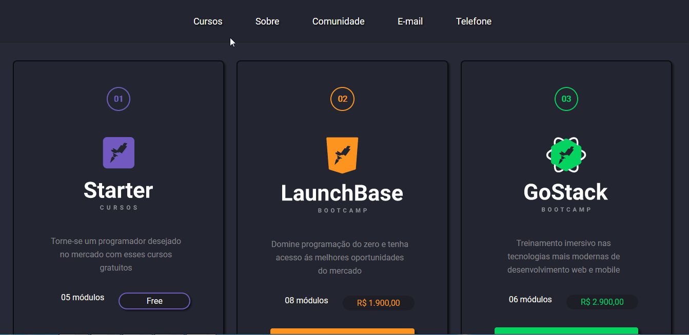
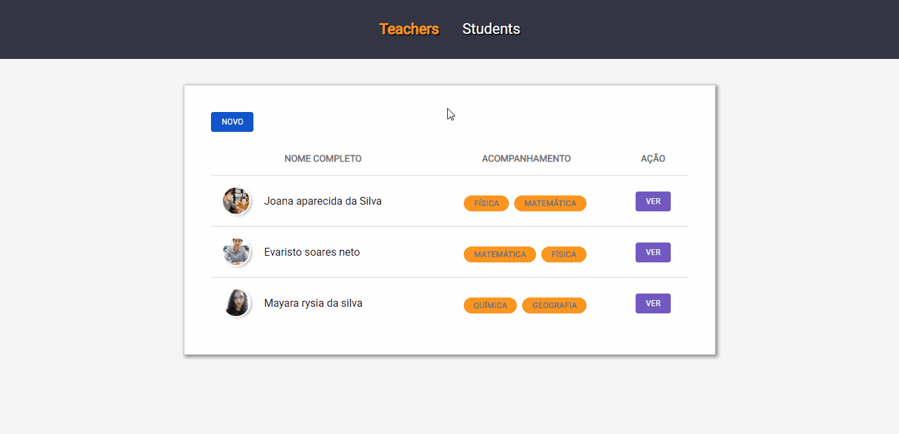

<h1 align="center">
    
</h1><br>

<p align="center">
  <a href="#semana01">Semana 01</a>&nbsp;&nbsp;&nbsp;|&nbsp;&nbsp;&nbsp;
  <a href="#semana02">Semana 02</a>&nbsp;&nbsp;&nbsp;|&nbsp;&nbsp;&nbsp;
  <a href="#semana03">Semana 03</a>&nbsp;&nbsp;&nbsp;|&nbsp;&nbsp;&nbsp;
  <a href="#semana04">Semana 04</a>&nbsp;&nbsp;&nbsp;|&nbsp;&nbsp;&nbsp;
  <a href="#executar">Como executar os projetos</a>&nbsp;&nbsp;&nbsp;|&nbsp;&nbsp;&nbsp;
  <a href="#contribuir">Como contribuir</a>&nbsp;&nbsp;&nbsp;|&nbsp;&nbsp;&nbsp;  
  <a href="#licença">Licença</a>
</p>

<p align="center">
 

  

  
</p>

<br>

## :books: Sobre

<p align="justify">
O LaunchBase 2.0 é um treinamento no formato de bootcamp online que tem duração de 6 semanas. É ofertado pela Rocketseat e tem o objetivo de guiar o aluno pelas ferramentas e conceitos mais modernos de desenvolvimento que permitirá construir as melhores aplicações e avançar na direção certa no desenvolvimento web.
</p><br>

## ⚒️ Tecnologias utilizadas
 * HTML5
 * CSS3
 * JavaScript
 * Node.JS
 * Express
 * Postgres
 * SQL

<a id="semana01"></a><br>

## :date: Semana 01
<br>
<p align="justify">
Na primeira semana foram abordados conceitos de introdução a programação, iniciando com front-end e iniciando com back-end.
</p><br>

### 🌟 Introdução a programação 

<br>

- Conceitos abordados:
    - Variáveis
    - Condicionais
    - Operadores
    - Objetos
    - Vetores
    - Funções e métodos
    - Estruturas de repetição
    - Escopos
    - Booleanos
    - Organização
    - Padronização
    - Escrita.

<br>

O [desafio 01](challenge01_questoes) consistia em aplicar todos esses conceitos em questões que foram elaboradas pela Rocketseat. A cada término de um conceito, tinha um desafio para praticá-lo. Ao todo foram 6 questões.

- [Questão 01](https://github.com/Rocketseat/bootcamp-launchbase-desafios-01/blob/master/desafios/01-1-primeiros-passos-com-js.md), [cálculo do IMC](challenge01_questoes/IMC.js).

- [Questão 02](https://github.com/Rocketseat/bootcamp-launchbase-desafios-01/blob/master/desafios/01-1-primeiros-passos-com-js.md), [calculadora de aposentadoria](challenge01_questoes/retirement.js).

- [Questão 03](https://github.com/Rocketseat/bootcamp-launchbase-desafios-01/blob/master/desafios/01-2-lidando-com-objetos-e-vetores.md), [criação de objeto](challenge01_questoes/company.js) .

- [Questão 04](https://github.com/Rocketseat/bootcamp-launchbase-desafios-01/blob/master/desafios/01-3-funcoes-e-estruturas-de-repeticao.md), [usuário e tecnologia](challenge01_questoes/technology.js).

- [Questão 05](https://github.com/Rocketseat/bootcamp-launchbase-desafios-01/blob/master/desafios/01-3-funcoes-e-estruturas-de-repeticao.md), [soma de despesas e receitas](challenge01_questoes/expenses.js).

- [Questão 06](https://github.com/Rocketseat/bootcamp-launchbase-desafios-01/blob/master/desafios/01-4-aplicacao-operacoes-bancarias.md), [operações bancárias](challenge01_questoes/bankingOperations.js).<br><br><br>


### 🎨 Iniciando com front-end

<br>

Abordou os principais elementos do [HTML](https://github.com/Rocketseat/bootcamp-launchbase-desafios-02/blob/master/materiais/html.pdf) e as principais propriedades de estilização [CSS](https://github.com/Rocketseat/bootcamp-launchbase-desafios-02/blob/master/materiais/css.pdf). 

<p>O <strong>desafio 02</strong> consistia em 4 partes, onde eram propostos desafios. Nas partes 1, 2 e 3 tínhamos que criar uma página de apresentação da Rocketseat, onde o layout era livre e o aluno poderia exercitar a sua criatividade, apenas tinha que seguir algumas instruções. 
Na parte 4 era dado o layout para construção de um site completo para uma empresa de receitas chamada Foodfy.<p><br>

[Desafio 02.1](challenge02.1_rocketseat) - <strong>Site da Rocketseat</strong><br>

- [Parte 01](https://github.com/Rocketseat/bootcamp-launchbase-desafios-02/blob/master/desafios/02-1-primeiro-html.md)
  -  Criação do menu;
- [Parte 02](https://github.com/Rocketseat/bootcamp-launchbase-desafios-02/blob/master/desafios/02-2-pagina-descricao.md)
  - Página de descrição da Rocketseat;
- [Parte 03](https://github.com/Rocketseat/bootcamp-launchbase-desafios-02/blob/master/desafios/02-3-pagina-cursos-e-iframe.md)
  - Página de cursos da rocketseat e iframes.

<br>

#### RESULTADO 


<br><br>

[Desafio 02.2](challenge02.2_foodfy) - <strong>Site do Foodfy</strong>

- [Parte 04](https://github.com/Rocketseat/bootcamp-launchbase-desafios-02/blob/master/desafios/02-foodfy.md)
  - Criação do layout do Foodfy.

<br>

#### RESULTADO 


<br><br>

### 🗃️ Iniciando com back-end

<br>

<p> <strong>Desafio 03 </strong> consistia em 4 partes, onde foi realizado a refatoração do código do site da Rocketseat e do Foodfy.</p><br>

[Desafio 03.1](challenge03.1_rocketseat) - <strong>Refatoração do site da rocketseat </strong><br>

- [Parte 01](https://github.com/Rocketseat/bootcamp-launchbase-desafios-03/blob/master/desafios/03-1-primeiro-servidor.md)
  - Criação do servidor
  - Definição de rotas
  - Instalação e configuração do Nunjucks
  - Trazendo o front-end do site para o servidor
  - Tornar todas as páginas dinâmicas com Nunjuck
  - Criação da página de erro 404

- [Parte 02](https://github.com/Rocketseat/bootcamp-launchbase-desafios-03/blob/master/desafios/03-2-nunjucks-e-dados-dinamicos.md)
  - Exportando e importando JavaScript
  - Passando dados do Back-end para o front-end
  - Atualizando página cursos e sobre

- [Parte 03](https://github.com/Rocketseat/bootcamp-launchbase-desafios-03/blob/master/desafios/03-3-pagina-descricao-curso.md)
  - Pegando o id do curso via route params
  - Filtrando elementos do array de courses
  - Estruturando a página de cursos
  - Criação da página de descrição de cada curso
  - Reconfigurando o iframe
  - Redirecionando URL com JavaScript

<br>

  #### RESULTADO 



<br><br>

[Desafio 03.2](challenge03.2_foodfy) - <strong>Refatoração do site do foodfy</strong><br>

<br>

- [Parte 04](https://github.com/Rocketseat/bootcamp-launchbase-desafios-03/blob/master/desafios/03-refatorando-foodfy.md)
  - Criação do servidor
  - Criação das rotas
  - Tornando os dados mais dinâmico
  - Criação da página de descrição das receitas

<br>

#### RESULTADO 


<br><br>

#### [Site de apresentação de um portfólio](portfolio)

<br>

#### RESULTADO 


<br>

<a id="semana02"></a><br>

## :date: Semana 02
<br>

<p> <strong>O Desafio 04 </strong> consistia em 8 partes, onde foi desenvolvido um site de aulas particulares e a criação de uma área administrativa para o Foodfy.</p><br>

[Desafio 04.1](challenge04.1_privateLessons) - <strong> Site de aulas particulares </strong><br>

<br>

- [Parte 01](https://github.com/Rocketseat/bootcamp-launchbase-desafios-04/blob/master/desafios/04-1-header.md)
  - Criação de um header com dois links: teachers e students.

- [Parte 02](https://github.com/Rocketseat/bootcamp-launchbase-desafios-04/blob/master/desafios/04-2-card-teacher.md)
  - Utilizar o browser-sync
  - criar um card para apresentação das informações do professor

- [Parte 03](https://github.com/Rocketseat/bootcamp-launchbase-desafios-04/blob/master/desafios/04-3-form-and-routes-teacher.md)
  - Criar um formulário de cadastro do professor
  - Criar uma rota do tipo post que realiza as validações e salva os dados enviados.

- [Parte 04](https://github.com/Rocketseat/bootcamp-launchbase-desafios-04/blob/master/desafios/04-4-show-edit-format-teacher.md)
  - Criar duas rotas: uma para apresentar os dados do professor (show) e outra para a edição dos dados cadastrados (edit).
  - Formatar os dados cadastrados para a correta exibição no HTML.

- [Parte 05](https://github.com/Rocketseat/bootcamp-launchbase-desafios-04/blob/master/desafios/04-5-put-delete-teacher.md)
  - Implementar duas rotas: PUT e DELETE para a atualização e remoção, respectivamente, dos dados cadastrados de um professor.

- [Parte 06](https://github.com/Rocketseat/bootcamp-launchbase-desafios-04/blob/master/desafios/04-6-list-teachers.md)
  - Listar todos os professores salvos no arquivo json e apresentá-los em formato de tabela.

- [Parte 07](https://github.com/Rocketseat/bootcamp-launchbase-desafios-04/blob/master/desafios/04-7-students.md)
  - Criar toda a estrutura de estudantes, baseado na estrutura de professores.

<br>

#### RESULTADO 



<br><br>

[Desafio 04.2](challenge04.2_foodfy) - <strong> Administrativa do Foodfy </strong><br>

- [Parte 08](https://github.com/rocketseat-education/bootcamp-launchbase-desafios-04/blob/master/desafios/04-admin-foodfy.md)
  - Criar uma área administrativa para o Foodfy, que será responsável por cadastrar, editar e deletar os dados do arquivo.

  <br>

#### RESULTADO 


<br>

<a id="semana03"></a><br>

## :date: Semana 03
<br>

No [desafio 05.1](challenge05.1_privateLessons) foi realizado a persistência dos dados do [desafio 04.1](challenge04.1_privateLessons) e adicionado o mecanismo de busca e a paginação. 

Este desafio foi dividido em 4 partes:

<br>

- [Parte 01](https://github.com/Rocketseat/bootcamp-launchbase-desafios-05/blob/master/desafios/05-1-refatorando-aplicacao.md)
  -  Refator o código da aplicação e preparar o ambiente para trabalhar com banco de dados.

- [Parte 02](https://github.com/rocketseat-education/bootcamp-launchbase-desafios-05/blob/master/desafios/05-2-interagindo-bd.md)
  -  Refatorar os CRUDs dos professores e estudantes para que eles utilizem o banco de dados.

- [Parte 03](https://github.com/rocketseat-education/bootcamp-launchbase-desafios-05/blob/master/desafios/05-3-relacionamentos-filtros-bd.md)
  - Criar um relacionamento entre professor e estudante
  - Implementar filtros na listagem da tabela de professores.

- [Parte 04](https://github.com/rocketseat-education/bootcamp-launchbase-desafios-05/blob/master/desafios/05-4-paginacao-bd.md)
  - Implementar a lógica de paginação dos resultados do BD.

<br>

#### RESULTADO 


<br>

<a id="semana04"></a><br>

## :date: Semana 04
<br>


<br>

<a id="semana05"></a><br>

## :date: Semana 05
<br>

<br>

<a id="semana06"></a><br>

## :date: Semana 06
<br>


<a id="executar"></a><br>

## 🚀 Como executar o projeto

<br>

- Clone este repositório

```
git clone https://github.com/RuthMaria/launchBase2.0.git
```

- Instale todas as dependências do projeto

```
npm install 
```

<br>

### :clapper: Executando os projetos

<br>

#### ✔️ Challenge02.1_rocketseat, challenge02.2_foodfy ou portfolio

<br>

- Baixar a extensão "watch in chrome" no Visual Studio Code e no Chrome
- Abrir no VSCode o arquivo index do respectivo challenge
- Pressione Ctrl + Shift + P no Visual Studio Code e selecione a opção "watch in chrome"
<br><br>

#### ✔️ Challenge03.1_rocketseat, challenge03.2_foodfy, challenge04.1_privateLessons ou challenge05.1_privateLessons

<br>

Substituia as linhas [07](https://github.com/RuthMaria/launchBase2.0/blob/master/package.json#L7) e [08](https://github.com/RuthMaria/launchBase2.0/blob/master/package.json#L8) do arquivo package.json pelas linhas seguintes (referente ao challenge que deseja executar):

<br>

- challenge03.1_rocketseat
  
```
"nodemon": "nodemon challenge03.1_rocketseat/server.js",
"browsersync": "browser-sync start --proxy http://localhost:5000 --files 'public, views'"
```

- challenge03.2_foodfy
  
```
"nodemon": "nodemon challenge03.2_foodfy/server.js",
"browsersync": "browser-sync start --proxy http://localhost:5000 --files 'public, views'"
```

- challenge04.1_privateLessons
  
```
"nodemon": "nodemon challenge04.1_privateLessons/server.js",
"browsersync": "browser-sync start --proxy http://localhost:5000 --files 'public, views'"
```

- challenge04.2_foodfy
  
```
"nodemon": "nodemon challenge04.1_foodfy/server.js",
"browsersync": "browser-sync start --proxy http://localhost:5000 --files 'public, views'"
```

- challenge05.1_privateLessons

```
"nodemon": "nodemon challenge05.1_privateLessons/src/server.js",
"browsersync": "browser-sync start --proxy http://localhost:5000 --files 'public,src/app/views'"
```
 Em seguida, crie o [banco de dados](challenge05.1_privateLessons/src/config/querysSql_db.js) no postgres e [configure a conexão](challenge05.1_privateLessons/src/config/db.js).

<br>

- Rodar o projeto
```
npm start
```

<a id="contribuir"></a><br>

## 🎯 Como contribuir

- Dê um Fork neste repositório,
- Crie uma branch com sua feature: `git checkout -b my-feature`
- Commit suas mudanças: `git commit -m 'feat: My new feature'`
- Push sua branch: `git push origin my-feature`

<a id="Licença"></a><br>

## :memo: Licença

Este projeto está sobre a licença MIT. Veja o arquivo [LICENSE](LICENSE.md) para mais detalhes.

---

<h4 align="center">
    Feito com 💜 by <a href="https://www.linkedin.com/in/ruth-maria-9b256071/" target="_blank">Ruth Maria</a>
</h4>